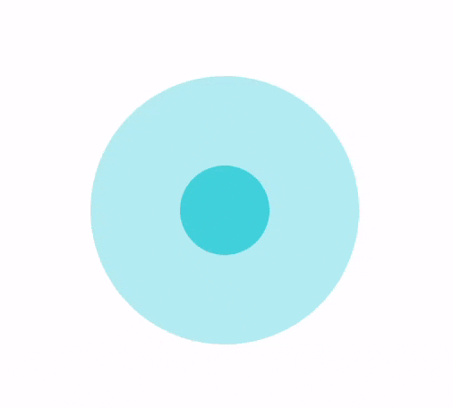

# React Native Joystick

[](https://nodei.co/npm/@korsolutions/react-native-joystick)

[](https://expo.io/client)

## TOC

- [Installation](#installation)
- [Preview](#preview)
- [Usage](#usage)
- [Props](#props)
- [Types](#types)

## Installation

**NPM**

```shell
npm install @korsolutions/react-native-joystick react-native-gesture-handler --save
```

**YARN**

```shell
yarn add @korsolutions/react-native-joystick react-native-gesture-handler
```

Add GestureHandlerRootView at the root level of your app.
```js
import { GestureHandlerRootView } from "react-native-gesture-handler";

<GestureHandlerRootView>
  <YourApp />
</GestureHandlerRootView>
```

## Preview



## Usage

```js
import { ReactNativeJoystick } from "@korsolutions/react-native-joystick";
```

```js
<ReactNativeJoystick color="#06b6d4" radius={75} onMove={(data) => console.log(data)} />
```

## Props

### radius

Set the size radius of the container circle
The inside joystick radius is 1/3 of this size
Type: **Number**

### color

Set the color scheme of the joystick
The color of the container and the joystick is set based on this color with a set opacity.

type: **HEX Color Code**

### onMove, onStart, onStop

A callback function with an argument of type [MoveJoystickEvent](#MoveJoystickEvent).

type: **Function**

## Types

### MoveJoystickEvent

Event returned by the onMove, onStart and onStop callbacks.

```js
{
  type: "move" | "stop" | "start";
  position: {
    x: number;
    y: number;
  }
  force: number;
  angle: {
    radian: number;
    degree: number;
  }
}
```
